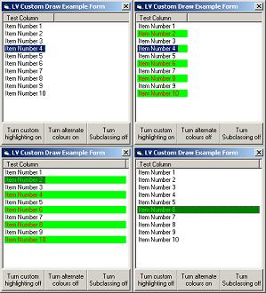



## Custom Drawn ListView

### Description

<JUST UPDATED - FIXED MULTIHIGHLIGHT BUG>

This Will allow the programmer to customise the individual foreground background colours of the different listview items, and can give a listview a custom highlight colour, with out modification to this code.

Any votes and/or comments will be much appreciated.
 
### More Info
 
Add this code in the Form_Load event:

Attach Me.hWnd, ListView

And don't forget to UnAttach in your form_unload event:

UnAttach me.hWnd

To set whether a custom highlight colour is used call:

UseCustomHighLight True

or

UseCustomHighLight false

To Set whether a listviews items will have alternating colours call:

UseAlternatingColour True

or

UseAlternatingColour False

To set the custom highlight colour use this code:

Dim NewColours as ItemColourType

NewColours.ForeGround = Your Colour Code Here

NewColours.BackGround = Your Colour Code Here

SetHighLightColour NewColours

To Set the custom alternating colour (the first colour is the default foreground/background colours) call:

Dim NewColours as ItemColourType

NewColours.ForeGround = Your Colour Code Here

NewColours.BackGround = Your Colour Code Here

SetCustomColour NewColours

Nothing really, may help to read the readme.txt file and understand the concepts before trying to customise this code.

A Custom Drawn ListView control

With multi selection on and more than one item highlighted there is an intrusive refresh flicker, caused by continual refresh.

You'll have to be careful when running in the IDE, as subclassing can crash your computer.

Obviously this is slower than letting the listview look after itself.

There can be problems getting the colours to display right during scrolling, they can appear missaligned - i know not why.

Highlight colour tends to dissapear on coloumns that are being resized, and will not reappear until the item is clicked, even though the item is still flagged as selected. Again i'm not sure what causes this.

The selection is always hidden when the listView doesn't have the focus, no matter what value is set in hideselection.

Any other listviews on the same form will not display correctly.

Setting alternating colours will overlay any background picture.

             |
---                |---
**Submitted On**   |2002-02-17 06:03:16
**By**             |[Citizen\_Suicide](https://github.com/Planet-Source-Code/PSCIndex/blob/master/ByAuthor/citizen-suicide.md)
**Level**          |Intermediate
**User Rating**    |4.3 (17 globes from 4 users)
**Compatibility**  |VB 5\.0, VB 6\.0
**Category**       |[Custom Controls/ Forms/  Menus](https://github.com/Planet-Source-Code/PSCIndex/blob/master/ByCategory/custom-controls-forms-menus__1-4.md)
**World**          |[Visual Basic](https://github.com/Planet-Source-Code/PSCIndex/blob/master/ByWorld/visual-basic.md)
**Archive File**   |[Custom\_Dra556832172002\.zip](https://github.com/Planet-Source-Code/citizen-suicide-custom-drawn-listview__1-31852/archive/master.zip)

### API Declarations

Many - see code ModAPIDeclares

